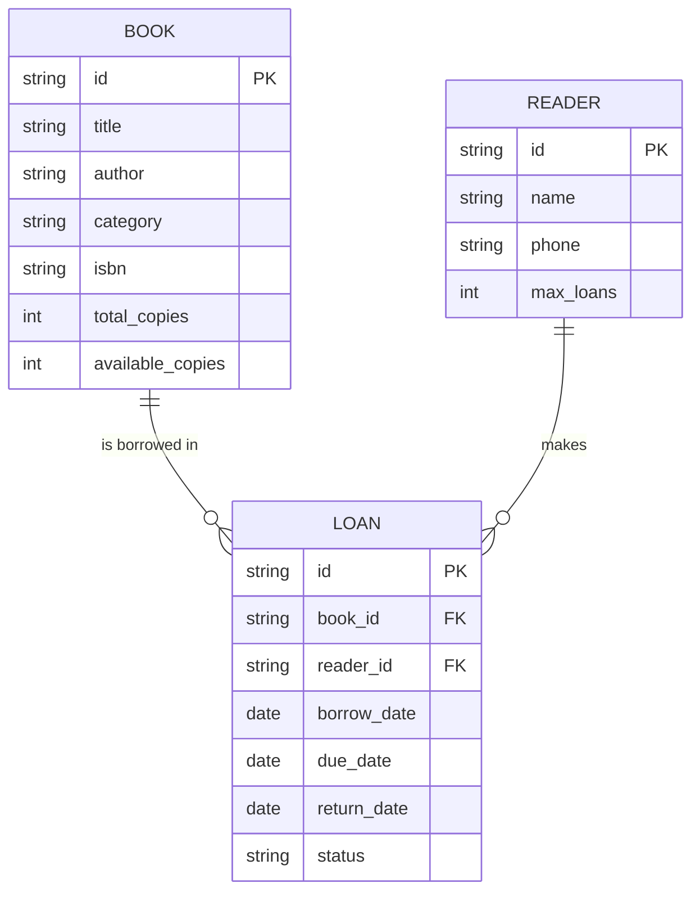
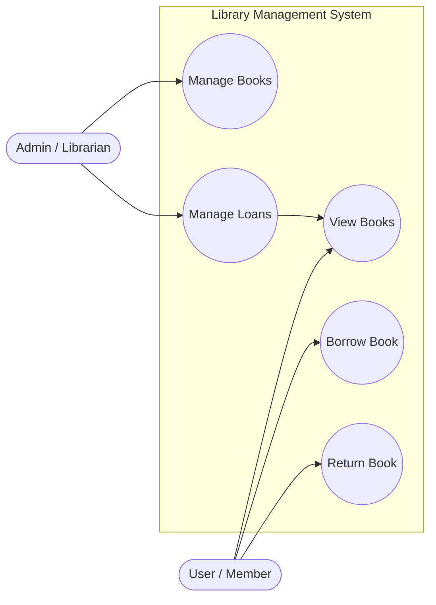
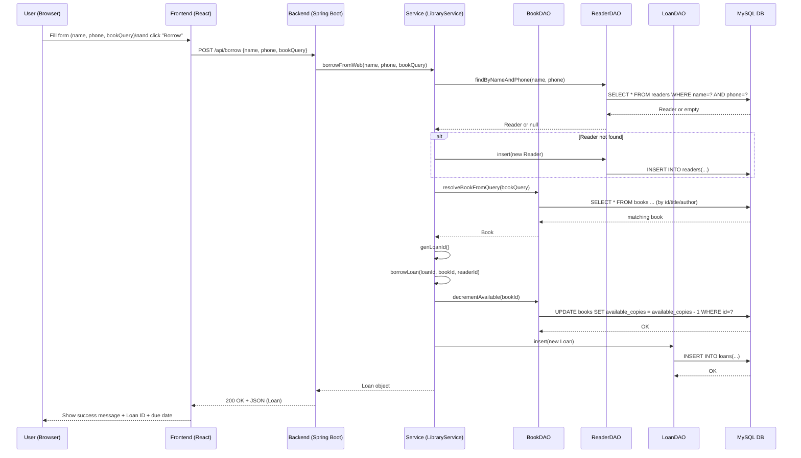

# 📚 Library Management System (Web-based)

## 1. Giới thiệu

**Library Management System** là một hệ thống quản lý thư viện dạng **Web Application**, cho phép:
- Thủ thư (Admin) quản lý sách, độc giả và các phiếu mượn/trả.
- Người dùng (User/Thành viên) có thể trực tiếp mượn sách và trả sách thông qua giao diện web.

Hệ thống được xây dựng theo mô hình **Client – Server**, bao gồm Backend và Frontend giao tiếp thông qua REST API.

---

## 2. Công dụng & chức năng

### 🔐 Admin (Thủ thư)
- Thêm / sửa / xoá sách (lưu trực tiếp vào MySQL)
- Quản lý số lượng sách và tình trạng còn sẵn
- Xem danh sách mượn sách
- Xác nhận trả sách
- Theo dõi sách quá hạn

### 👤 User (Thành viên)
- Xem danh sách sách hiện có trong thư viện
- Mượn sách bằng họ tên + số điện thoại
- Trả sách bằng mã phiếu mượn
- Chọn sách trực tiếp từ danh sách (UI hỗ trợ)

---

## 3. Công nghệ sử dụng

### Backend
- Java 17
- Spring Boot
- JDBC + DAO Pattern
- MySQL
- RESTful API

### Frontend
- React + TypeScript
- Vite
- Tailwind CSS
- shadcn/ui

---

## 4. Cấu trúc project

```
DeTaiCuoiKi/
├── backend/
│   ├── src/main/java/
│   │   ├── Controller/
│   │   ├── Service/
│   │   ├── DataAccessObject/
│   │   ├── ModelLibrary/
│   │   └── DataBase/
│   └── pom.xml
│
├── frontend/
│   ├── src/
│   │   ├── api/
│   │   ├── components/
│   │   └── pages/
│   └── package.json
│
└── README.md
```

---

## 5. Hướng dẫn cài đặt

### Yêu cầu
- Java JDK 17+
- Node.js 18+
- MySQL 8+

---

### Bước 1: Tạo Database

```sql
CREATE DATABASE library_db;
USE library_db;
```

Tạo các bảng `books`, `readers`, `loans` theo file SQL trong project.

---

### Bước 2: Chạy Backend

Mở terminal tại thư mục gốc project:

```powershell
.\mvnw.cmd spring-boot:run
```

Backend chạy tại:
```
http://localhost:8080
```

---

### Bước 3: Chạy Frontend

```bash
cd frontend
npm install
npm run dev
```

Mở trình duyệt:
```
http://localhost:5173
```

---

## 6. Cách sử dụng

### Admin
1. Vào trang quản lý sách
2. Thêm sách mới → dữ liệu lưu trực tiếp vào MySQL
3. Quản lý mượn/trả sách

### User
1. Truy cập trang thành viên
2. Chọn sách cần mượn
3. Nhận mã phiếu mượn
4. Trả sách bằng mã phiếu

---

## 7. Luồng hoạt động

- Admin thêm sách → DB
- User load trang → lấy dữ liệu từ DB
- User mượn sách → tạo loan
- Admin/User trả sách → cập nhật lại DB

---

## 8. Mở rộng tương lai

- Đăng nhập & phân quyền
- Xuất báo cáo
- Thông báo quá hạn
- Lịch sử mượn theo người dùng

---

## 9. Tác giả

- Sinh viên: ...
- MSSV: ...
- Môn học: ...
- GVHD: ...

---

✅ **Project hoàn chỉnh, dữ liệu đồng bộ giữa Admin – User – Database.**

---

# 📚 Library Management System (Web-based) – English Version

## 1. Introduction

The **Library Management System** is a simple web-based application that helps manage a small library.  
It provides two main roles:

- **Admin (Librarian)** – manages books and borrow/return transactions.
- **User (Member)** – borrows and returns books through a friendly web interface.

The system follows a **Client–Server** architecture:
- **Backend**: Java Spring Boot + JDBC + MySQL
- **Frontend**: React + TypeScript + Vite

---

## 2. Features

### 👩‍💼 Admin (Librarian)

- Manage books:
  - Create / update / delete books
  - Manage total quantity and available copies
  - Store metadata: category, ISBN, author, title
- Manage loans:
  - View all borrow records (loans)
  - See status: *borrowed*, *returned*, *overdue*
  - Confirm book returns directly in the interface
- Search & filter:
  - Search by book ID, title, author, category, ISBN
  - Search by loan ID, member name, phone number

### 👤 User (Member)

- View the list of available books (fetched directly from the database)
- Borrow books by providing:
  - Full name
  - Phone number
  - Book (can be selected from the list or typed as ID/title)
- Automatically receive a **Loan ID**
- Return books by entering the Loan ID

---

## 3. Tech Stack

### Backend

- Java 17
- Spring Boot
- JDBC + DAO pattern
- MySQL
- RESTful API (JSON over HTTP)

### Frontend

- React + TypeScript
- Vite
- Tailwind CSS
- shadcn/ui
- Lucide React Icons

---

## 4. Project Structure

```text
DeTaiCuoiKi/
├── backend/
│   ├── src/main/java/
│   │   ├── Controller/        # REST controllers (LibraryRestController, ...)
│   │   ├── Service/           # Business logic (LibraryService, ...)
│   │   ├── DataAccessObject/  # DAO classes (BookObject, ReaderObject, LoanObject)
│   │   ├── ModelLibrary/      # Entity models (Book, Reader, Loan)
│   │   └── DataBase/          # Database connection helper
│   └── pom.xml                # Maven configuration
│
├── frontend/
│   ├── src/
│   │   ├── api/               # API wrapper (LibraryApi.ts)
│   │   ├── components/        # React components (Admin & User screens)
│   │   └── main.tsx           # App entry point
│   └── package.json           # Frontend dependencies
│
└── README.md
```

---

## 5. Installation Guide (English)

### 5.1 Requirements

- Java **JDK 17+**
- Node.js **18+**
- MySQL **8+**
- Maven (or use the included `mvnw` wrapper)

### 5.2 Database Setup

1. Create the database:

```sql
CREATE DATABASE library_db;
USE library_db;
```

2. Create tables `books`, `readers`, `loans` according to the provided SQL script or entity definitions.

3. Configure database connection in Spring Boot (e.g. in `application.properties`):

```properties
spring.datasource.url=jdbc:mysql://localhost:3306/library_db
spring.datasource.username=root
spring.datasource.password=your_password
spring.datasource.driver-class-name=com.mysql.cj.jdbc.Driver

spring.jpa.hibernate.ddl-auto=none
```

> Adjust the username, password, and URL according to your environment.

### 5.3 Run Backend

From the **backend** (or project root if `mvnw` is there) directory:

```bash
# Windows PowerShell
.\mvnw.cmd spring-boot:run

# macOS / Linux (if wrapper is executable)
./mvnw spring-boot:run
```

If successful, you should see something similar to:

```text
Started LibraryApplication in X.XXX seconds
Tomcat started on port 8080
```

Backend base URL:

```text
http://localhost:8080
```

### 5.4 Run Frontend

From the `frontend` directory:

```bash
npm install
npm run dev
```

Frontend dev server:

```text
http://localhost:5173
```

You can now open the app in your browser.

---

## 6. Usage

### 6.1 Admin Flow

1. Open the web app in the browser.
2. Go to the **Book Management** screen:
   - Add new books (ID, Title, Author, Category, Quantity, ISBN, etc.).  
   - Books are saved directly into MySQL.
3. Go to the **Borrowing Management** screen:
   - View all loan records.
   - See status (borrowed / returned / overdue).
   - Confirm returns with a single click.
   - Search by Loan ID, member name, phone, book title.

### 6.2 User Flow

1. Go to the **User / Member** screen.
2. View the list of books in the library (live data from the database).
3. Choose a book:
   - Either click **"Select to borrow"** from the list (which fills the book ID),  
   - Or type book title / ID manually.
4. Fill in your name and phone.
5. Submit the borrow request → the system:
   - Resolves the book from your query,
   - Creates a new reader (if needed),
   - Creates a loan and returns a **Loan ID** + due date.
6. To return a book:
   - Enter the **Loan ID** in the **Return** form.
   - If valid, the system marks the loan as returned and increases the book’s available copies.

---

## 7. Data Model & Diagrams

### 7.1 Entity-Relationship Diagram (ERD)



- **BOOK** – stores book information and inventory.
- **READER** – stores member information.
- **LOAN** – represents each borrow transaction.

---

### 7.2 Use Case Diagram



**Admin Use Cases:**
- *Manage Books*: add / edit / delete books.
- *Manage Loans*: monitor borrow/return, mark as returned.

**User Use Cases:**
- *View Books*: browse available books.
- *Borrow Book*: request a loan.
- *Return Book*: complete a loan using Loan ID.

---

### 7.3 Sequence Diagram – Borrowing a Book



---

## 8. Future Improvements

- Authentication & Role-based Authorization
- Email/SMS notifications for overdue books
- Reports and export to Excel/PDF
- Better UI for mobile devices
- Pagination & advanced search

---

## 9. Author

- Student: *(fill your name)*  
- Student ID: *(fill your ID)*  
- Course: *(fill course name)*  
- Instructor: *(fill instructor name)*  

---

✅ The project provides a complete, working **full-stack library management system** with synchronized data between **Admin**, **User**, and the **database**, and can be extended easily for real-world use.
